# DEC-Hackathon - The Travel Agency Use Case

This project was created in the spirit of the Data Engineering Community Hackathon by the Data Benders team.


*Image by [fonsheijnsbroek_amsterdam_photos](https://unsplash.com/@fonsheijnsbroek_amsterdam_photos) on Unsplash*

## Introduction

As a data engineer at a travel agency, you have been tasked with integrating data from a public REST API for countries information. This data will be used to recommend travel destinations to our customers based on some different factors like language, continents, regions, currency and many more.

*Disclaimer: This data was gotten from the [world country api](https://restcountries.com/v3.1/all).*

## Factors Considered While Choosing Tools Used
- Simplicity

- Scalability

- Not time-consuming

- Data Volume

- Data Velocity

- Data Variety

- Cost Effectivenes

## Tools Used

The following tools and skills were used in this project:
* **Python** used for extraction and transformation: Python was used because of the requests library to extract data from APIs and it's ability to transform data especially if the data is not so large as in this usecase.

* **PostgreSQL** for data storage: This was used to store the data for analysis because the data output after transformation is in structured format. This was hosted on a free hosting platform called 'Aiven' to allow remote access. However, in a company setting, it would be advised to host this on the company's cloud. Warehouses like Redshift, BigQuery, etc are not encouraged at this stage because it would be a big solution for a small usecase as this. Considering scalability, postgres can still suffice unless it can no longer handle the company's data at some point in time.

* **Airflow** used for Orchestration: At first, we thought this was an overly technical solution for a usecase like this and thought of using a simple cron job instead. However, we considered that since this was a travel agency, there could be variety of data that could spring up so it was best to start with Airflow since it's open-source and won't incur any extra costs asides the hosting. 

## ETL Architecture Diagram


## Data Extraction and Transformation Steps

- Step 1: Fetch Data from the API

- Step 2: Extract Required Fields

    The fields we needed include:
    - Country name
    - Independence status
    - United Nations membership
    - Start of the week
    - Official country name
    - Common native name
    - Currency (code, name, symbol)
    - Country code (concatenate idd root and idd suffix)
    - Capital
    - Region
    - Sub region
    - Languages
    - Area
    - Population
    - Continents

- Step 3: Make Necessary Transformations
    
    The transformations made include:

    - Dropped duplicates
    - Replaced empty strings (null) with None
    - Transformed the continents column to align with the correct country's continenent
    - Split and modeled the data into three dataframes to be inserted into the postgres database: Countries, Country_languages (bridge table) and languages

- Step 4: Load DataFrames to PostgreSQL database

## Data Model


## Questions 

1. How many countries speaks French?
2. How many countries speaks english?
3. How many country have more than 1 official language?
4. How many country official currency is Euro?
5. How many country is from West europe?
6. How many country has not yet gain independence?
7. HHow many distinct continent and how many country from each?
8. How many country whose start of the week is not Monday?
9. How many countries are not a United Nation member?
10. How many countries are United Nation member?
11. Least 2 countries with the lowest population for each continents?
12. Top 2 countries with the largest Area for each continent?
13. Top 5 countries with the largest Area?
14. Top 5 countries with the lowest Area?

## Answers to Stated Questions

### 1. How many countries speaks French?

```sql
SELECT COUNT(DISTINCT c.country_name) AS num_countries
FROM countries c
JOIN country_languages cl ON c.country_id = cl.country_id
JOIN languages l ON cl.language_id = l.language_id
WHERE l.language_name = 'French';
```

**Results**
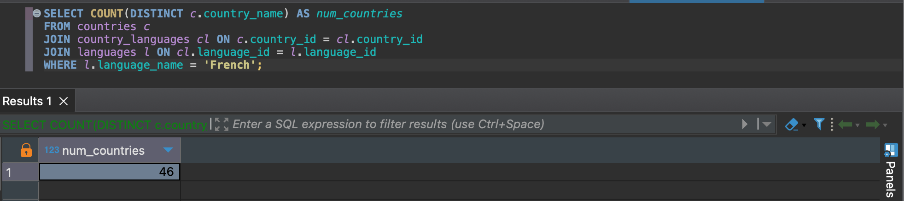


### 2. How many countries speak English?

```sql
SELECT COUNT(DISTINCT c.country_name) AS num_countries
FROM countries c
JOIN country_languages cl ON c.country_id = cl.country_id
JOIN languages l ON cl.language_id = l.language_id
WHERE l.language_name = 'English';
```

**Results**

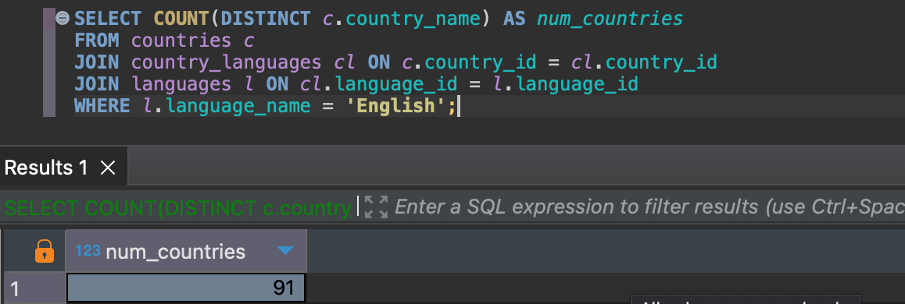

### 3. How many countries have more than one official language?

```sql
SELECT COUNT(country_id) AS num_countries
FROM (
    SELECT country_id, COUNT(language_id) AS num_languages
    FROM country_languages
    GROUP BY country_id
    HAVING COUNT(language_id) > 1
) AS multi_lang_countries;
```

**Results**

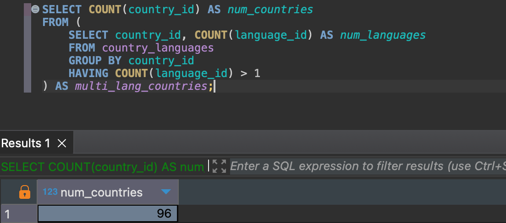

### 4. How many countries have the Euro as their official currency?

```sql
SELECT COUNT(*) AS num_countries
FROM countries
WHERE currency_code = 'EUR';
```

**Results**

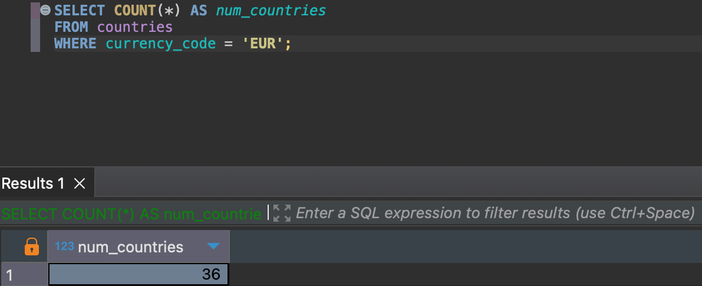

### 5. How many countries are from Western Europe?

```sql
SELECT COUNT(*) AS num_countries
FROM countries
WHERE sub_region = 'Western Europe';
```

**Results**

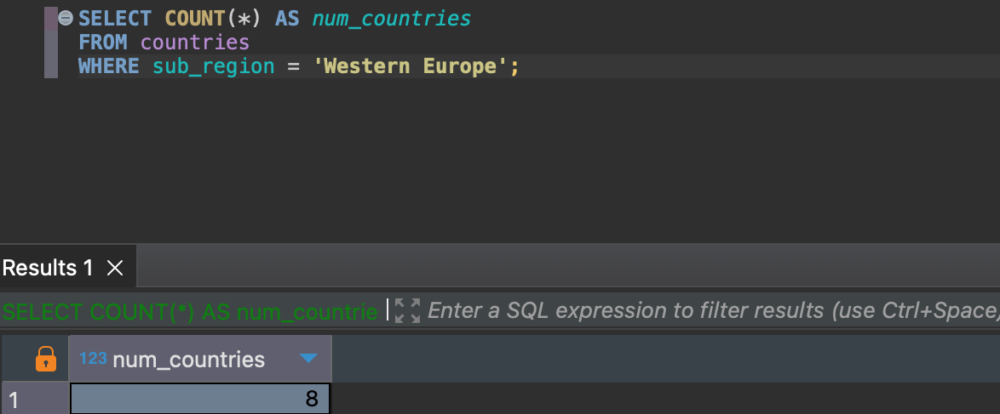

### 6. How many countries have not yet gained independence?
```sql
SELECT COUNT(*) AS num_countries
FROM countries
WHERE independence = FALSE;
```

**Results**

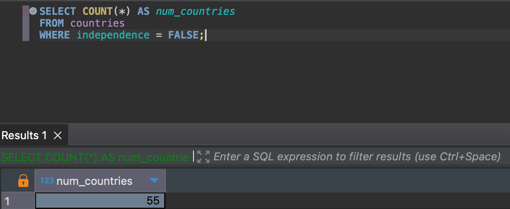

### 7. How many distinct continents and how many countries from each?

```sql
SELECT continents, COUNT(*) AS num_countries
FROM countries
GROUP BY continents;
```

**Results**

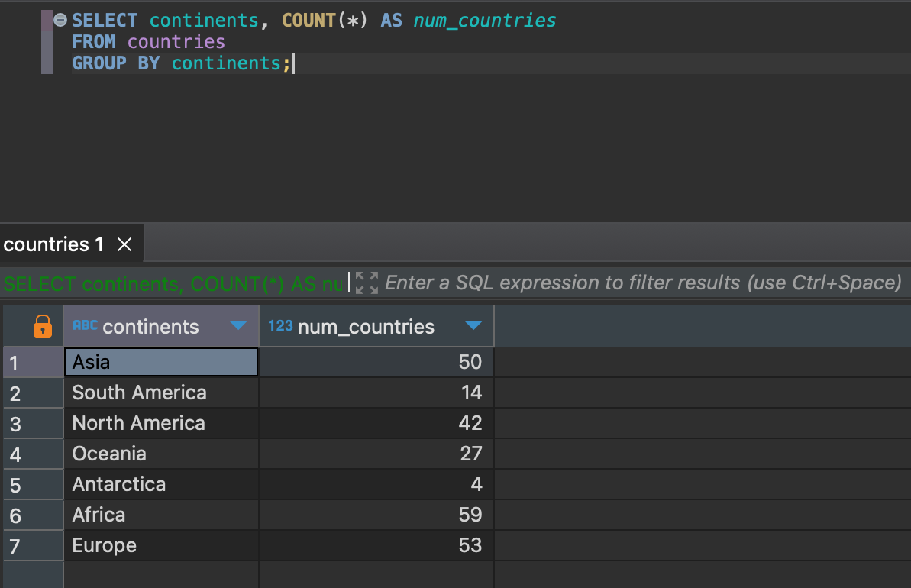


### 8. How many countries start the week on a day other than Monday? 

```sql
SELECT COUNT(*) AS num_countries
FROM countries
WHERE start_of_week != 'monday';
```

**Results**

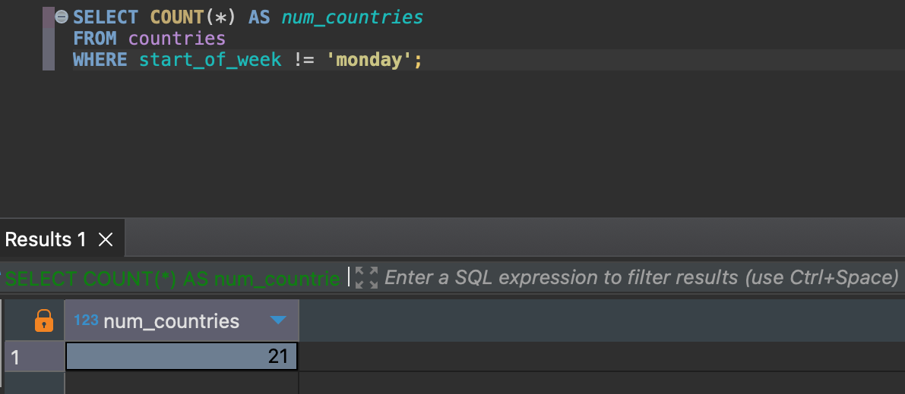


### 9. How many countries are not United Nations members?

```sql
SELECT COUNT(*) AS num_countries
FROM countries
WHERE united_nations_member = FALSE;
```

**Results**

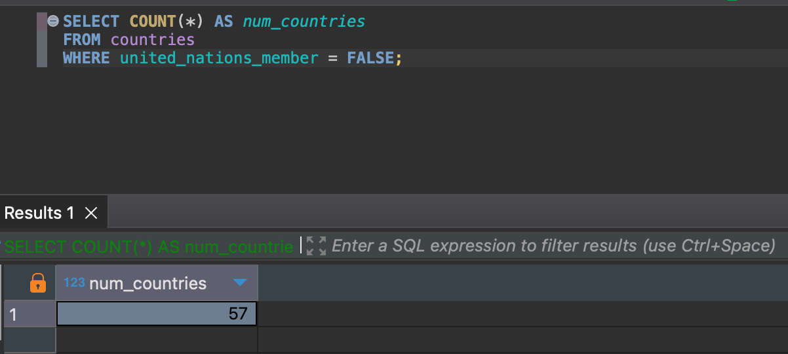


### 10. How many countries are United Nations members?

```sql
SELECT COUNT(*) AS num_countries
FROM countries
WHERE united_nations_member = TRUE;
```

**Results**

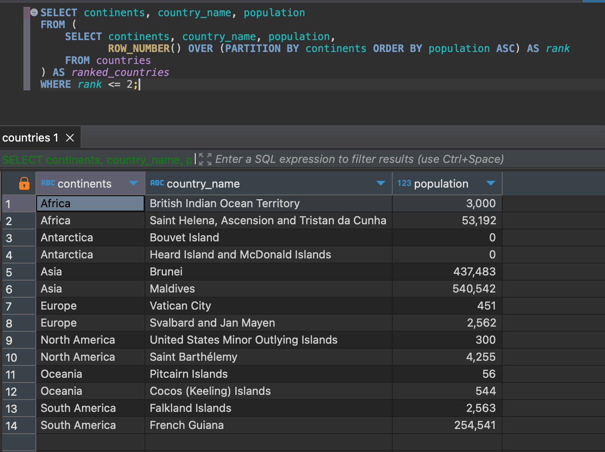


### 11. At least 2 countries with the lowest population for each continent?

```sql
SELECT continents, country_name, population
FROM (
    SELECT continents, country_name, population,
           ROW_NUMBER() OVER (PARTITION BY continents ORDER BY population ASC) AS rank
    FROM countries
) AS ranked_countries
WHERE rank <= 2;
```

**Results**


### 12. Top 2 countries with the largest area for each continent?

```sql
SELECT continents, country_name, area
FROM (
    SELECT continents, country_name, area,
           ROW_NUMBER() OVER (PARTITION BY continents ORDER BY area DESC) AS rank
    FROM countries
) AS ranked_countries
WHERE rank <= 2;
```

**Results**

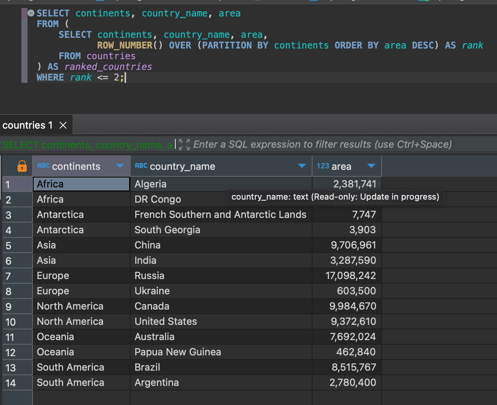


### 13. Top 5 countries with the largest area?

```sql
SELECT country_name, area
FROM countries
ORDER BY area DESC
LIMIT 5;
```

**Results**

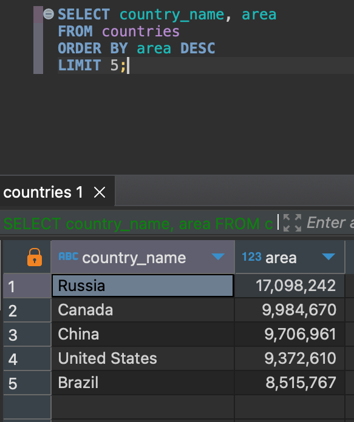


### 14. Top 5 countries with the lowest area?

```sql
SELECT country_name, area
FROM countries
ORDER BY area ASC
LIMIT 5;
```

**Results**

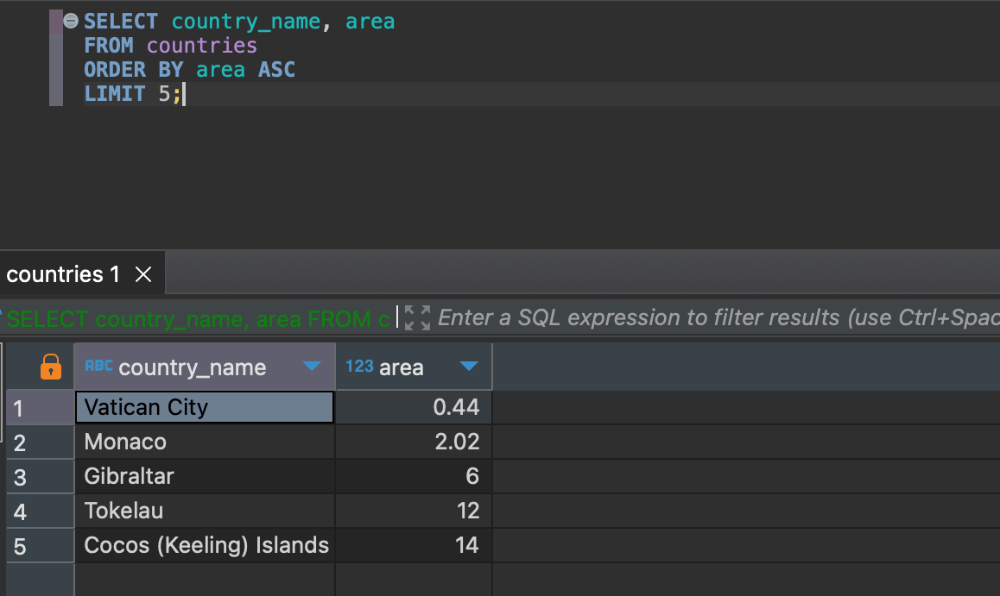

##  Conclusion/Recommendations

In building a sustainable and resilient data infrastructure for a company, it's important to consider several factors. Because one considers scalabilty doesn't mean that he/she should go for a big tool for a very small usecase. Choose a simple solution that can work for the company for a long time while also minimizing cost. 

That way, the company would see one as a valuable data engineer.

This was what we tried to portray while working on this hackathon project.

Thank you!